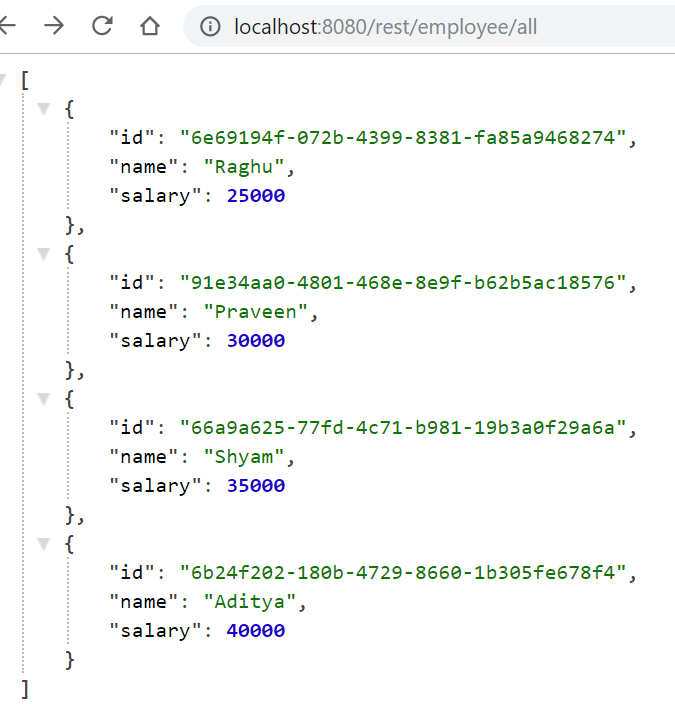

# Objective:

The objective of this project is to build reactive API's with Spring WebFlux and use Reactive MongoDB library.

# Pre-requsites:
The following softwares are to be installed on your machine for this code to work:
* JDK 11 or Open JDK 11
* Maven

# Instructions for the setup:

* Git clone the project
* Open Command prompt and go to the root directory path (/reactive-mongo-sample) and run the following command, which will pull the MongoDB docker image and run the same
```
docker-compose up
```
* Open another Command prompt and go to the root directory path (/reactive-mongo-sample) and run the following command, which will start the application
```
mvnw clean install && java -jar target/reactive-mongo-sample-0.0.1-SNAPSHOT.jar
```
* As part of the output of the above command, if everything is working correctly, you should finally see the following output in the console, which indicate that 4 sample records are successfully inserted to MongoDB during Server start up
```
...
...
Employee(id=6b24f202-180b-4729-8660-1b305fe678f4, name=Aditya, salary=40000)
Employee(id=6e69194f-072b-4399-8381-fa85a9468274, name=Raghu, salary=25000)
Employee(id=91e34aa0-4801-468e-8e9f-b62b5ac18576, name=Praveen, salary=30000)
Employee(id=66a9a625-77fd-4c71-b981-19b3a0f29a6a, name=Shyam, salary=35000)
```
* Now open the Browser (or any rest client like Postman) and invoke the following URL which will fetch all the 4 employees (as shown in the screen shot below) that were inserted during Server startup:
```
http://localhost:8080/rest/employee/all
``` 

* Copy any id value from the above output (in my case, I copied 6e69194f-072b-4399-8381-fa85a9468274). Now open another Browser (or any rest client like Postman) and hit the following URL with the copied id appended at the end of the URL (in my case, I copied 6e69194f-072b-4399-8381-fa85a9468274), which will fetch only one employee detail (as shown in the screen shot below):
```
http://localhost:8080/rest/employee/6e69194f-072b-4399-8381-fa85a9468274
``` 

* Now open Browser (or any rest client like Postman) and hit the following URL with /events appended at the end of the URL, which will fetch continous stream of text events (as shown in the screen shot below):
```
http://localhost:8080/rest/employee/6e69194f-072b-4399-8381-fa85a9468274/events
``` 


# References:
* If you want to know more about the Reactive programming concepts and Spring Reactor, you can refer them in my blog here.
```
https://shyamtechno.blogspot.com/2019/06/basics-of-reactive-programming-project.html
```
